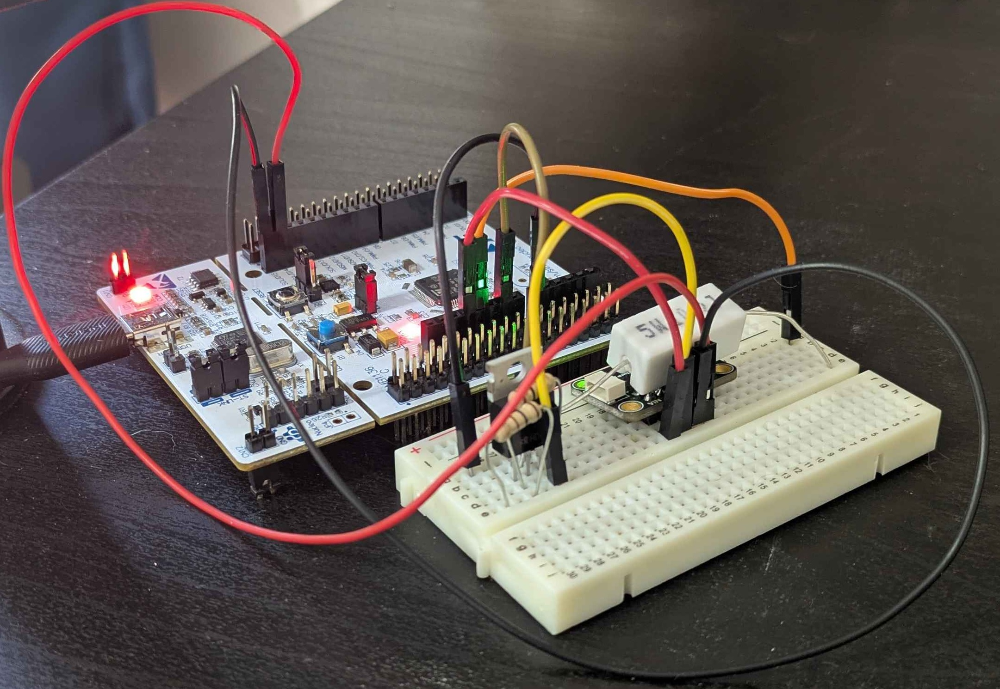
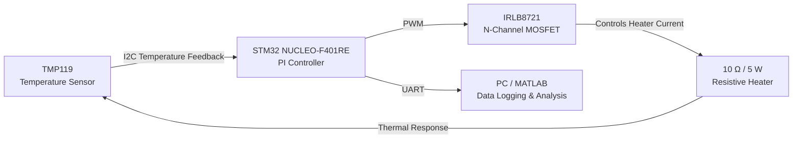
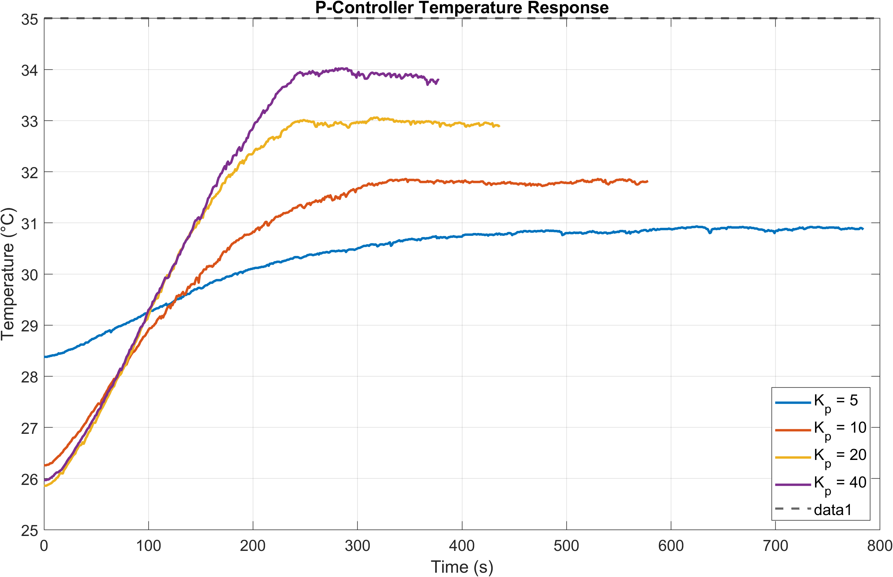
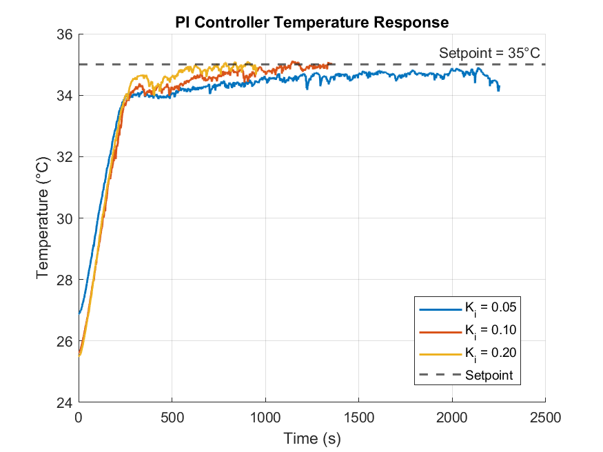
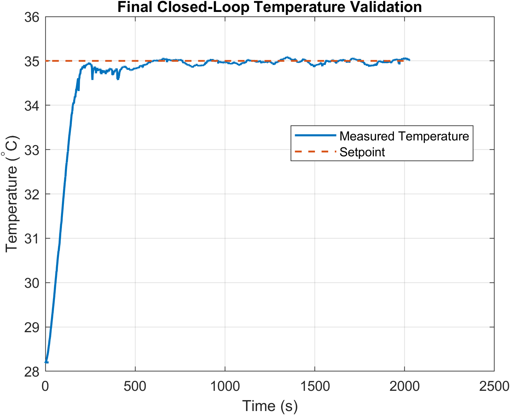
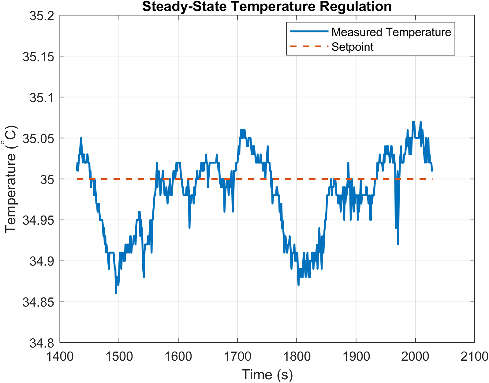
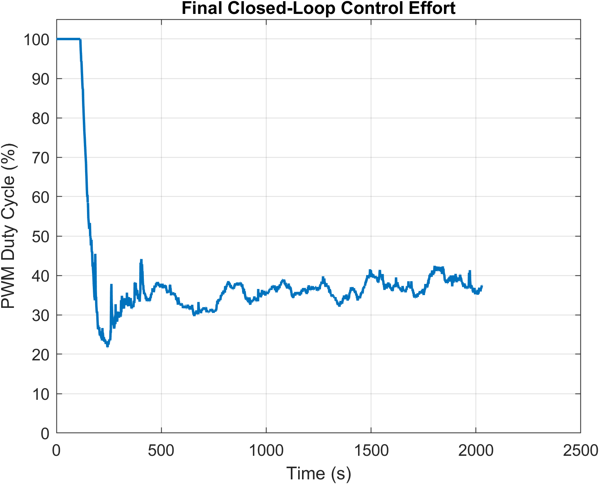

# Closed-Loop Embedded Thermal Controller

A closed-loop thermal control system implemented on an STM32 NUCLEO-F401RE using a TMP119 digital temperature sensor and a PWM-controlled resistive heater.

The system uses a discrete-time PI controller to regulate measured temperature to a user-defined setpoint. Temperature feedback is acquired over I2C, processed by the STM32, and used to continuously adjust the PWM duty cycle applied to a MOSFET-controlled heater.



## Project Motivation

This project was developed to gain practical experience with embedded firmware, electronic hardware integration, and feedback control systems.

The project provided hands-on experience with STM32 firmware development, I2C communication, timer-based PWM generation, MOSFET power control, feedback-control implementation, experimental characterization, MATLAB data analysis, and modular embedded software design.

The broader goal was to design, implement, and experimentally validate a complete physical control system while developing practical embedded-systems engineering skills.

## System Architecture



The TMP119 measures the local temperature of the thermally coupled heater/sensor assembly. The STM32 reads this measurement over I2C and converts the raw sensor output into degrees Celsius.

The measured temperature is compared with the desired setpoint to calculate the controller error. A PI algorithm then determines the required heater duty cycle. The resulting PWM signal drives an IRLB8721 N-channel MOSFET, which controls current through the resistive heater.

The resulting change in temperature is measured by the TMP119, completing the feedback loop.

UART telemetry is also transmitted from the STM32 to a host computer for experimental logging and MATLAB analysis.

## Hardware

The prototype was constructed using:

- STM32 NUCLEO-F401RE development board
- Texas Instruments TMP119 digital temperature sensor
- IRLB8721 HEXFET N-channel power MOSFET
- 10 Ω, 5 W power resistor used as the heater
- 100 Ω MOSFET gate resistor
- 10 kΩ gate-to-ground pull-down resistor
- Solderless breadboard
- Jumper wiring and supporting passive components

The power resistor was positioned directly over the TMP119 sensor to provide repeatable thermal coupling between the heater and temperature sensor.

The prototype heater was powered from the Nucleo 5 V rail. A dedicated external heater supply would be preferable in a future hardware revision.

## Software and Development Tools

The project uses:

- Embedded C
- STM32CubeIDE
- STM32 HAL
- I2C
- PWM / STM32 timer peripherals
- UART
- MATLAB
- Git

## Firmware Architecture

The application firmware was separated into dedicated sensor, controller, and actuator modules.

### `tmp119.c / tmp119.h`

The TMP119 driver handles communication with the temperature sensor over I2C.

It is responsible for:

- Reading the TMP119 temperature register
- Reconstructing the signed 16-bit sensor value
- Converting the measurement into degrees Celsius
- Returning the HAL communication status to the application

### `controller.c / controller.h`

The controller module implements the discrete-time PI control algorithm.

A `PI_Controller` structure stores the controller state and tuning parameters:

```c
typedef struct
{
    float Kp;
    float Ki;
    float dt;
    float integral;
} PI_Controller;
```

The module calculates the current temperature error, updates the integral state, and returns a requested heater duty cycle between 0% and 100%.

A simple conditional-integration strategy is used to reduce integral windup while the proportional contribution alone exceeds the available actuator range.

### `heater.c / heater.h`

The heater driver provides the interface between the control algorithm and the STM32 PWM peripheral.

It is responsible for:

- Constraining requested duty cycle to 0–100%
- Converting percentage duty cycle to the corresponding timer CCR value
- Updating the PWM compare register

The actuator driver retains its own duty-cycle clamp as a defensive hardware interface even though the controller output is also constrained.

### `main.c`

The main application coordinates the complete control loop:

```text
Read TMP119
    ↓
Convert temperature
    ↓
Execute PI controller
    ↓
Set heater PWM duty cycle
    ↓
Transmit UART telemetry
    ↓
Wait for next control interval
```

The PI controller operates with an update interval of approximately one second.

## PI Controller

The controller first calculates the temperature error:

$$
e[k] = T_{setpoint} - T[k]
$$

The discrete integral state is updated according to:

$$
I[k] = I[k-1] + e[k]\Delta t
$$

The controller output is then calculated as:

$$
u[k] = K_p e[k] + K_i I[k]
$$

where:

- $K_p$ is the proportional gain
- $K_i$ is the integral gain
- $\Delta t$ is the controller update interval
- $e[k]$ is the current temperature error
- $I[k]$ is the accumulated error
- $u[k]$ is the requested heater duty cycle

The resulting controller output is constrained to the physical actuator range:

$$
0 \leq u[k] \leq 100
$$

where \(u[k]\) is expressed as PWM duty cycle in percent.

## Open-Loop Thermal Characterization

Before implementing closed-loop control, the thermal behavior of the physical system was experimentally characterized.

Heating tests were performed at fixed PWM duty cycles of:

- 0%
- 25%
- 50%
- 75%
- 100%

Temperature samples were collected every 30 seconds for approximately five minutes at each duty cycle.

A separate cooling-response experiment was also performed after heating the system.

The results were analyzed in MATLAB to determine how heater duty cycle influenced temperature rise and to observe the thermal lag of the physical system.

This characterization provided a baseline understanding of the plant before implementing feedback control.

Raw open-loop experimental data are available under:

```text
Thermal Response Data/Open Loop/
```

## Proportional Controller Tuning

Controller development began using proportional-only control:

$$
u[k] = K_p e[k]
$$

The proportional gain was experimentally evaluated at:

| Kp | Steady-State Temperature | Steady-State Error |
|---:|---:|---:|
| 5 | 30.887 °C | 4.113 °C |
| 10 | 31.793 °C | 3.207 °C |
| 20 | 32.960 °C | 2.040 °C |
| 40 | 33.899 °C | 1.101 °C |

Increasing proportional gain produced a more aggressive heating response and progressively reduced steady-state error.

However, proportional control alone could not eliminate the offset from the 35 °C setpoint. Maintaining the target temperature requires continuous heater power, while a proportional controller produces zero output when the error reaches zero.

`Kp = 40` was selected for subsequent PI-controller testing because it produced the strongest stable proportional response among the tested values while reducing steady-state error to approximately 1.1 °C.



## PI Controller Tuning

Integral action was added to eliminate the remaining proportional-controller steady-state error.

With:

```text
Kp = 40
```

held constant, the integral gain was experimentally evaluated at:

```text
Ki = 0.05
Ki = 0.10
Ki = 0.20
```

`Ki = 0.05` produced a slow convergence toward the setpoint.

Increasing the integral gain improved the rate at which the remaining temperature error was eliminated. Both `Ki = 0.10` and `Ki = 0.20` produced low steady-state error and minimal overshoot.

Among the tested configurations, the final gains selected were:

```text
Kp = 40
Ki = 0.20
```

This configuration provided the best overall combination of convergence time, steady-state regulation, and low overshoot among the tested controller gains.



## Final Validation

Following controller tuning, the firmware was refactored into the modular sensor, controller, and heater architecture described above.

A final physical validation experiment was then performed using:

```text
Setpoint = 35.0 °C
Kp       = 40
Ki       = 0.20
dt       = 1.0 s
```

Before the experiment, the heater/sensor assembly was allowed to return near ambient temperature. The physical configuration of the heater, sensor, and electronics was kept unchanged.

The completed controller was operated continuously for approximately 2000 seconds.

During the experiment, UART telemetry was recorded at approximately one-second intervals using the format:

```text
time_s, temperature_C, setpoint_C, duty_pct
```

MATLAB was then used to analyze both the complete transient response and the final steady-state period.

### Final Performance

| Metric | Result |
|---|---:|
| Setpoint | 35.000 °C |
| Steady-state temperature | 34.994 °C |
| Measured steady-state error | 0.006 °C |
| Maximum temperature | 35.090 °C |
| Overshoot | 0.090 °C |
| Steady-state standard deviation | 0.025 °C |
| Steady-state duty cycle | 38.44% |

Steady-state statistics were calculated using the final 120 seconds of experimental data.

The final validation demonstrated that the completed PI controller could bring the measured temperature from ambient conditions to the 35 °C setpoint and maintain regulation with minimal overshoot.

The reported steady-state error describes the difference between the controller setpoint and the **TMP119 measurement**. It should not be interpreted as an absolute temperature-accuracy measurement of the resistor itself, since sensor accuracy, thermal coupling, airflow, and spatial temperature gradients also affect the physical system.

### Full Closed-Loop Response



The complete response shows the initial 100% heater command, approach toward the setpoint, reduction in controller output, and eventual steady-state regulation.

### Steady-State Regulation



The steady-state view highlights the small temperature variations around the 35 °C target after the initial transient has settled.

### Control Effort



The controller initially saturates the heater command at 100% while the system is far below the setpoint. As the temperature approaches 35 °C, the controller reduces the PWM duty cycle and continuously adjusts heater power to compensate for thermal losses.

## Data Acquisition and MATLAB Analysis

Experimental data from each stage of controller development were retained in the repository.

MATLAB scripts were used to:

- Import experimental CSV data
- Compare open-loop thermal responses
- Compare proportional-controller gains
- Compare PI-controller gains
- Plot transient temperature response
- Plot PWM control effort
- Analyze steady-state regulation
- Calculate steady-state temperature and error
- Calculate overshoot
- Calculate steady-state temperature variation

The raw measurements are retained alongside the analysis scripts so the experimental results can be independently inspected or reprocessed.

## Repository Structure

```text
Closed_Loop_Temp_Controller/
├── Firmware/
│   └── TMP119_Test/
│
├── Images/
│   └── thermal_controller_test_setup.jpg
│
├── MATLAB/
│   ├── plot_p_controller_results.m
│   ├── plot_pi_controller_results.m
│   ├── plot_final_validation.m
│   ├── P_Controller_Temperature_Response.png
│   ├── PI_Controller_Temperature_Response.png
│   ├── Final_Temperature_Response.png
│   ├── Final_Steady_State_Regulation.png
│   └── Final_Control_Effort.png
│
└── Thermal Response Data/
    ├── Open Loop/
    ├── P Controller/
    ├── PI Controller/
    └── Final Validation/
        └── final_validation.csv
```

## Future Improvements

Potential future revisions include:

- Replace the breadboard prototype with a dedicated PCB
- Use a dedicated external heater power supply rather than the Nucleo 5 V rail
- Add active cooling for bidirectional heating and cooling control
- Improve the mechanical and thermal coupling between the heater and sensor
- Evaluate more advanced integral anti-windup strategies
- Derive PWM timer scaling dynamically rather than relying on a fixed timer configuration
- Port the controller to an FPGA using fixed-point arithmetic
- Compare MCU and FPGA implementations of the same closed-loop control algorithm

## Lessons Learned

This project provided practical experience integrating embedded firmware with a physical dynamic system.

The project progressed from basic sensor communication and PWM control through open-loop plant characterization, proportional-control testing, PI tuning, firmware modularization, and final experimental validation.

A major takeaway was the importance of characterizing the physical system before tuning the controller. Experimental testing also demonstrated why proportional-only control can retain steady-state error and how integral action can provide the continuous actuator effort required to maintain a thermal setpoint.

The final implementation combines embedded firmware, digital communication, timer peripherals, power electronics, feedback control, experimental data acquisition, and MATLAB analysis into a complete closed-loop system.